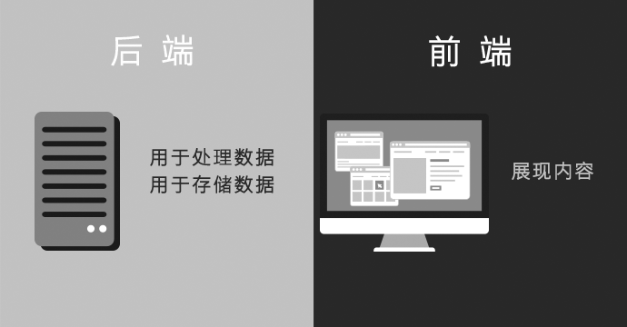
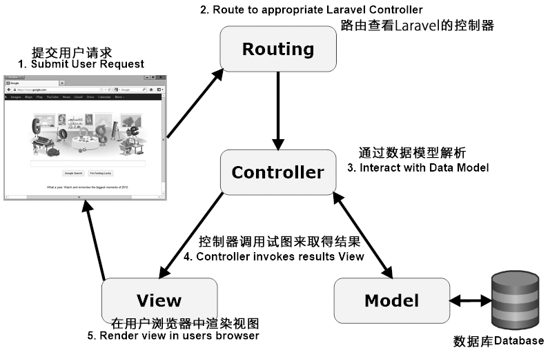

# 绪论

目前国内大学社团的现状与水平相较于之前明显提升很多，越来越多的社团开始用技术创新，开创了一些新奇的创业领域。小到开店卖水果奶茶，大到开技术公司，通过优秀的想法和兴趣来赚取了自己人生的第一桶金。不过很多人忽略了社团中管理人员的问题，其余利用工具化的管理，能让社团的管理更加合理化，同样的，整个社团也能花更多的精力在创新，活动中去。

## 课题研究的背景

从60年代，中国开始改革开放之后，再到79年人人可以通过考试进入大学。以至现如今，普遍的9年义务教育的时代。大学似乎是国内学生统一的接受知识的环境，这样的环境也同时让社团快速成长起来，以至于大学生参加社团活动成了其密不可分的组成。在这几十年里，大学生社团的管理也从分散逐渐走向严格，有序。管理好一个社团，成了每个社团的重中之重。

同时，有些不规范的管理方案，或者当前的管理方案没有很好的继承下去，下一年的社团必将经历一次重创。人员流失，人心涣散，整个社团死气沉沉，必不会是一个好社团继续发展的氛围。

良好的管理能带给社团活力，成员信息不会丢失，处理事务高效无误，将其他时间真正花在社团发展建设上去。新时期的高校大学生，价值观，世界观趋于多元化，如今的社团管理方式，在现社团上的管理效果甚微，如何去利用如今的信息化技术，科学化的管理社团人员，避免出现重复的劳力，脑力，让社团人员拥有更多的动力去开创新的领域实在是迫在眉睫的任务。

## 课题研究的意义

本课题先是通过文献研究，了解了国内社团部分出现崩塌，难以管理的现状，个人认为在科学管理方面，可以通过自身学习的计算机知识去开创一种方便的，高效的，简易的网站管理人员制度。这种想法正好可以与其他有关管理社团的想法，比如如何加强社团人员培养，人员交流方面，促进发展等等结合起来，共同形成统一，又自由化的制度体系。这样不仅让每个社团保留自己的个性，同样在未知领域有其他方案可以参考。构成新时期社团优秀的管理模式体系。

相较于传统的社团管理，工具化管理社团带来了多方面的创新：

1. 人员信息管理的变革。从之前的手动填写到现在的线上线下填写，并以电子方式的保存

1. 值班表制定的改变。利用计算机编程算法，自动计算每节课人员的安排情况

1. 社团课下学习的改变。使用线上统计的方式，方便地查看人员学习状况，促进成员学习

1. 通知活动人员的方式改变。从以前的每条短信人员编辑群发，到利用大公司的可靠 API 一键群发短信与邮件（有必要的话）

## 课题研究的目标

利用自己在大学中所学的知识，完成对社团管理系统的开发，实现如下目标：

1. 整体系统简易，对于学生几分钟就能够学会

1. 因为系统为分离式，所以每套系统都有各自的信息的导入导出功能

大致系统包含如下：

1. 报名系统——用于招新活动或比赛活动的报名，包括报名者信息填写、管理员信息收集等

1. 考核系统——用于人员选拔的水平初试、学习效果检测等

1. 通知系统——用于短信通知，如会议、面试等的通知

1. 学习系统——沟通与学习的平台，用于学习经验交流、生活心得体会、学习总结、学习笔记、学习进度等的记录，同时推送感兴趣或热门学习方向等

1. 值班系统——用于安排成员监管活动的小工具

1. 最后通过 Docker 工具进行快速的部署

## 网站开发的发展于现状

### 全栈的概念

全栈大多指的是全栈工程师，英文 Full Stack。指的是掌握多种开发调试等技能，并能利用这些技术独立完成产品的人。他们大多以网站开发为主，不仅对前端页面的设计与开发，也会后端接口的实现，更深层次的就是将网站内容搬移到 iOS 与 Android 等平台的 APP 上，实现狭义上的全栈开发。如果说到广义，那就还要加上产品的运维，调试，测试等等，甚至产品的宣传。

可以说，一个全栈工程师在公司里可以凭借一己之力，有效减少公司内部的沟通成本，人员的招聘成本。可以扛起这个部门系统架构，当公司业务调整的时候，每个方向的人力都可以做到有效的补充。

### 前端与后端的融合

说到前后的融合，这就不得不说到前端的一些历史，早在二十年前，前端并不存在，那时候网站开发，无论是功能还是界面设计都是由后端人员独自包揽。到后来，FLASH 可以用来做动画，用 Firework 切图，总之 Web 1.0 时代的网站建设两者并没有很好分离，使得工作流程十分混乱。但是随着 Web 2.0 的到来，网站内容越来越多，前后端逐渐分离，伴随而来的就是 JavaScript 再次的爆发性的发展，前端专注于与用户的交互，而后端则是专注数据的传输，服务的稳定提供。通过Restful API 等一些新兴协议，接口的定义更加规范，HTTP 传输的内容不再冗余。从此，前端开始出现了一些基于 JavaScript 的框架，如React， Angular 和 Vue 等，后端则更加复杂，加入了 Node 中间层对大量 API 请求进行分发，真正的后端处理安全性，可靠性与逻辑性，确保数据上的绝对安全。

### 前端的趋势

在之前讲了前端的来源，相信前端以后的路也十分好走。这一切都归功于 JavaScript 十年以来快速的发展，和 HTML5 的标准发布。2014年，第五代 HTML 标准发布。H5 是由浏览器厂商主导，与 W3C 合作制定的一整套 Web 应用规范，至今仍在不断补充新的草案。我们可以清晰的感受到这一系列规范背后隐含的领导者的勃勃雄心：占领所有屏幕。

从2010年开始出现的 Backbone、Angular.js 等前端 JavaScript 框架的出现。前端开始火了起来。

充分发挥 JavaScript 的本身优势，减少页面的重复刷新，只通过少量数据的更新来更新交互界面的数据。以 MVC，甚至之后更加流行的 MVVC 架构的前端框架支撑起了相当可靠的 SPA （Single Page Application，单页应用）。

以后的趋势也显现出来，一方面 React Native 等一系列框架入侵 Android 与 iOS 等原生 APP 之中，使一个模子的代码可以用在多种客户端中。另一方面 Hybird APP 的诞生，使得想 Weex 阿里的一站式框架得以发展，让 APP 的更新不再依赖每次应用商店的审核，而是通过内置的应用浏览器，对页面进行定期更新。常见的如：淘宝，天猫，京东，QQ等活动页，直接采用的是一些 H5 小页面。

### 后端的趋势

相较于前端，后端的任务则变得更为简单了一些。

**前后端理解**

互联网发展的早期，前端代码只是后端代码的一部分，大致流程如下：

1. 后端收到浏览器请求

1. 生成静态页面

1. 发送到浏览器

那时开发网站，一般采用的都是后端 MVC 模式

- Model（模型层）：提供/保存数据

- Controller（控制层）：数据处理，实现业务逻辑

- View（视图层）：展示数据，提供用户界面

前端只是后端 MVC 的 V。以 PHP 框架 Laravel 为例。

**后端 MVC 中的 View 前端视图**

由于 Ajax 技术的广泛应用，前端的应用终于可以独立出来，它们通过异步的请求获取少量数据，这些技术一开始广泛的应用于网页地图上。再到后来，乔布斯发布智能手机开始，很多人都意识到，这种异步获取数据能应用于许多领域上，比如 APP 数据的获取等等。

这两个原因，导师前端开发方式发生了根本的变化，前端不再是后端 MVC 中的 V，而是单独的一层。

前后端分离以后，他们之间通过接口通信进行双向数据传输。后端暴露出接口，前端消费后端提供的数据。后端接口一般是 REST 形式，前后端的通信协议一般是 HTTP。

同时，Node 在2009年诞生，这也就意味着本来只能跑在浏览器的 JavaScript 语言可以同样运行在服务器上，其中最大的意义就是前端工程师可以编写后端程序了。于是，前端工程师正慢慢转变为全栈工程师，一个人负责开发前端与后端，从数据库到 UI 的所有开发。

### Docker 集装箱模式的盛行

软件开发最大的麻烦事之一就是环境配置。开发环境与部署环境的环境不同，你怎么知道自家的软件，能在哪些机器跑起来？所以开发者必须知道两件事，操作系统是如何设置的，各种第三方库和组件要如何安装。只有当他们都被正确的运行起来，你所开发的程序才能如你所望的跑起来。举个例子，安装一个 Node 应用，计算机必须有 Node 引擎，还必须有各种依赖，可能还要配置环境变量。如果某些老旧的模块与当前环境不兼容，那就麻烦了。开发者常常会说："它在我的机器可以跑了"（It works on my machine），言下之意就是，其他机器很可能跑不了。环境配置如此麻烦，换一台机器，就要重来一次，旷日费时。很多人想到，能不能从根本上解决问题，软件可以带环境安装？也就是说，安装的时候，把原始环境一模一样地复制过来。

**虚拟机**

虚拟机（virtual machine）就是带环境安装的一种解决方案。它可以在一种操作系统里面运行另一种操作系统，比如在 Windows 系统里面运行 Linux 系统。应用程序对此毫无感知，因为虚拟机看上去跟真实系统一模一样，而对于底层系统来说，虚拟机就是一个普通文件，不需要了就删掉，对其他部分毫无影响。

虽然用户可以通过虚拟机还原软件的原始环境。但是，这个方案有几个缺点。

1. 资源占用多。虚拟机会独占一部分内存和硬盘空间。它运行的时候，其他程序就不能使用这些资源了。哪怕虚拟机里面的应用程序，真正使用的内存只有 1MB，虚拟机依然需要几百 MB 的内存才能运行。

1. 冗余步骤多。虚拟机是完整的操作系统，一些系统级别的操作步骤，往往无法跳过，比如用户登录。

1. 启动慢。启动操作系统需要多久，启动虚拟机就需要多久。可能要等几分钟，应用程序才能真正运行。

**Linux 容器**

由于虚拟机存在这些缺点，Linux 发展出了另一种虚拟化技术：Linux 容器（Linux Containers，缩写为 LXC）。

Linux 容器不是模拟一个完整的操作系统，而是对进程进行隔离。或者说，在正常进程的外面套了一个保护层。对于容器里面的进程来说，它接触到的各种资源都是虚拟的，从而实现与底层系统的隔离。

由于容器是进程级别的，相比虚拟机有很多优势。

1. 启动快。容器里面的应用，直接就是底层系统的一个进程，而不是虚拟机内部的进程。所以，启动容器相当于启动本机的一个进程，而不是启动一个操作系统，速度就快很多。

1. 资源占用少。容器只占用需要的资源，不占用那些没有用到的资源，虚拟机由于是完整的操作系统，不可避免要占用所有资源。另外，多个容器可以共享资源，虚拟机都是独享资源。

1. 体积小。容器只要包含用到的组件即可，而虚拟机是整个操作系统的打包，所以容器文件比虚拟机文件要小很多。

总之，容器有点像轻量级的虚拟机，能够提供虚拟化的环境，但是成本开销小得多。

**Docker**

Docker 属于 Linux 容器的一种封装，提供简单易用的容器使用接口。它是目前最流行的 Linux 容器解决方案。

Docker 将应用程序与该程序的依赖，打包在一个文件里面。运行这个文件，就会生成一个虚拟容器。程序在这个虚拟容器里运行，就好像在真实的物理机上运行一样。有了 Docker，就不用担心环境问题。

总体来说，Docker 的接口相当简单，用户可以方便地创建和使用容器，把自己的应用放入容器。容器还可以进行版本管理、复制、分享、修改，就像管理普通的代码一样。

Docker 的主要用途，目前有三大类。

1. 提供一次性的环境。比如，本地测试他人的软件、持续集成的时候提供单元测试和构建的环境。

1. 提供弹性的云服务。因为 Docker 容器可以随开随关，很适合动态扩容和缩容。

1. 组建微服务架构。通过多个容器，一台机器可以跑多个服务，因此在本机就可以模拟出微服务架构。
