# 系统设计

## 系统布局

考虑到本系统的复杂性，与基于每个社团的需求不一，所以将每个系统单独出来，各个完成。如有些社团仅需要报名与值班系统，我只要为你部署这两个系统即可，数据通过 CSV 表格形式进行人为传输。确保数据的可靠性与流动性。其次考虑到每个系统环境不一样，所以利用简单的 Docker 配置，可以一次性的安装多个系统。方便一些操作人员操作。

由于每个系统功能都有很大差别，所以系统设计每个模块都有不同的技术选型，一来，每个技术都有自己适合的领域，使开发方便又不容易出错。二来，尝试不同的技术，可以很好的察觉不同技术之间的差距，避免以后犯一些技术选型错误。三来，每个技术都可以展现自己不同时期学习的情况，也同样反应新技术更迭速度快，需要我们更快的理解新技术的诞生与发展趋势。

以下我会以技术选型的不同，分别介绍这六大系统模块。这三大技术，分别是：

1. 以 PHP 和 MySQL 为基础的 ThinkPHP3.2 版本框架（报名系统与考核系统）

1. 以 JavaScript 为基础的 Express 和 Pug 框架（群发短信平台，学习平台，值班系统）

1. 以 JavaScript 为基础的，以前后端分离为思想的 Vue 前端框架与 Koa 后端接口框架（邮件群发平台）

## 技术选型

### ThinkPHP3.2 框架

ThinkPHP 是以 PHP 为底层的框架。相较于其他 Laravel，Yii，Zend 等大型框架，ThinkPHP 框架属于轻量型框架，没有什么特殊模块要求，底层运行的内容消耗也很低，不会出现空间和内存占用的瓶颈。并且它支持 Mysql、MsSQL、PgSQL、Sqlite、Oracle、Ibase、Mongo以及PDO等多种数据库和连接。对于这种一般型的项目足以。

1. 项目后端的搭建

- 使用 PHP 语言的 ThinkPHP3.2 框架完成网站后端搭建

- 使用 mysql 完成数据存储，通过 model 模块完成对 mysql 数据的构建使用 thinkphp 模板引擎完成页面创建渲染

- 使用 ThinkPHP的 关联模型构建关系型模型

2. 项目前端搭建

- 使用 jQuery 和 Bootsrap 完成网站前端JS脚本和样式处理

- 使用 jQuery.min.js 完成对账号以及选项的判断

- 前后端的数据请求交互通过Ajax完成

#### 报名管理系统

**设计**

项目相关设计 UI 图如下所示

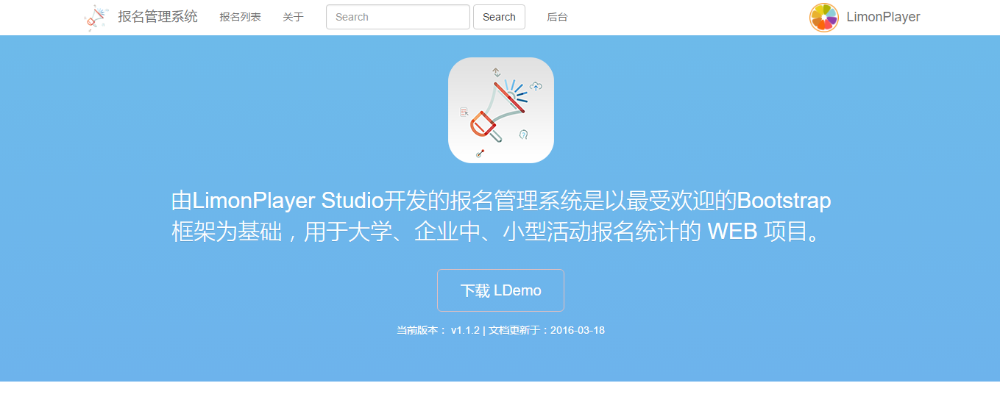

**图4-1 报名首页**

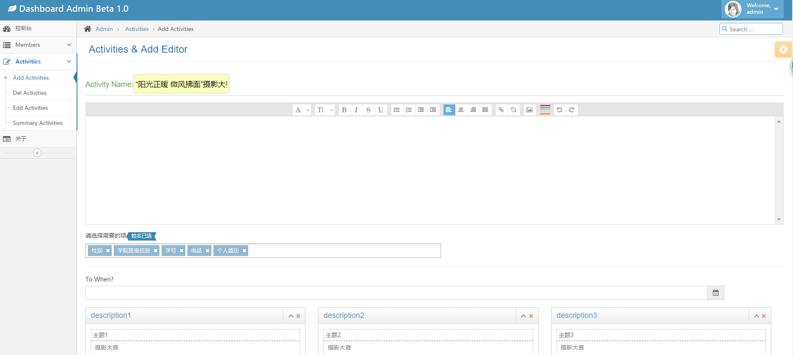

**图4-2 后台管理页**

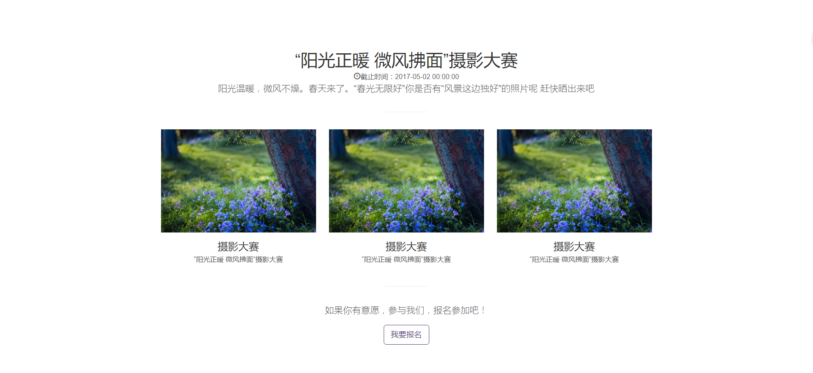

**图4-3 报名页**

**详细功能**

本项目主要有活动活动的创建与 excel 导出功能，其次有对活动时间的控制，可以对活动进行修改，富文本的编辑与操作。

#### 考核系统

**设计**

项目相关设计 UI 图如下所示

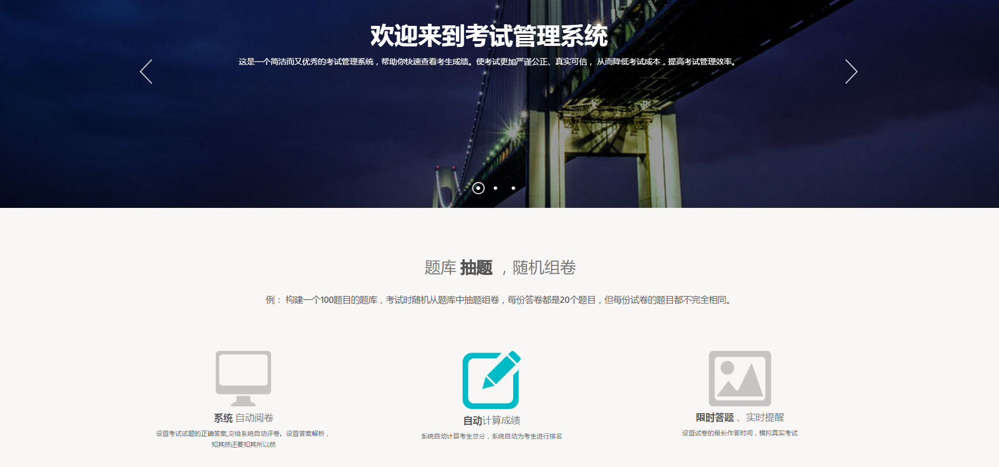

**图4-4 项目首页**

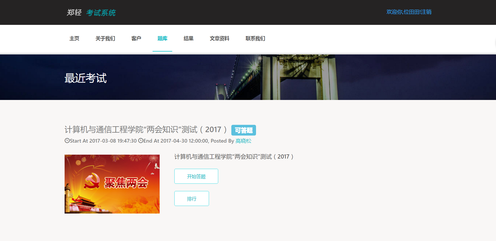

**图4-5 选择考试页**

**详细功能**

本项目主要由试卷 exam 和文章 article 两大模型

- 其中具有重要特色的功能是对试卷的添加与编辑和批改等功能

- 其次在克服试卷的模型上我们做了很多尝试，最后用了稳定而不易出错的-  thinkphp 自带关联模型

- 对用户的考试成绩进行排序 rank (可以比较出学员的优异性)

- 对考试时间的设定与修改

- 还有对大量用户数据的批量处理

- 对用户的权限处理

### Express 与 Pug 框架

1. 项目后端的搭建

- 使用 NodeJs 的 express 框架完成网站后端搭建

- 使用 mongodb 完成数据存储，通过 mongoose 模块完成对 mongodb 数据的构建使用 pug 模板引擎完成页面创建渲染

- 使用 Moment.js 格式化电影存储时间

- 利用 alibaba.aliqin.fc.sms.num.send（短信发送）收费API作为发短信支持

2. 项目前端搭建:

- 使用 jQuery 和 Bootsrap 完成网站前端JS脚本和样式处理

- 使用 jQuery.min.js 完成对账号以及选项的判断

- 前后端的数据请求交互通过 Ajax 完成

- 前端的页面渲染通过 PUG 最新插件完成

- 跨域的数据请求交互通过 Ajax 中的 jsonp 完成

#### 短信群发平台

**设计**

项目相关设计 UI 图如下所示

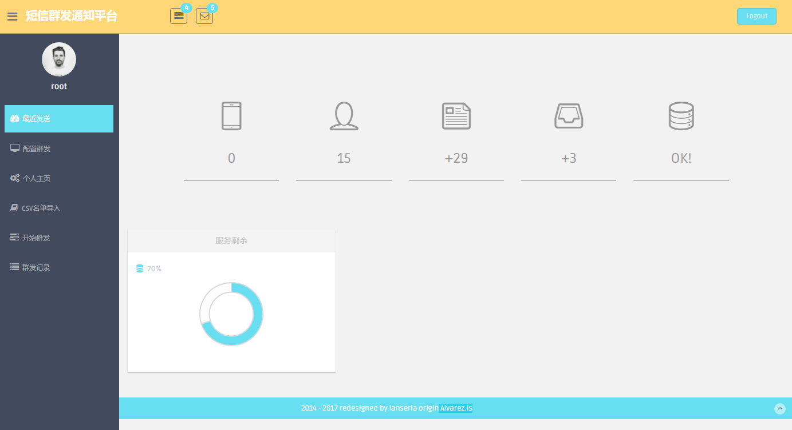

**图4-6 项目首页**

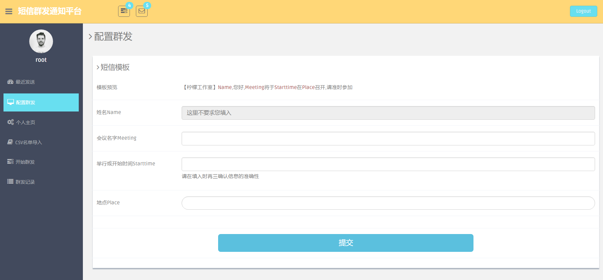

**图4-7 模板信息填写页**

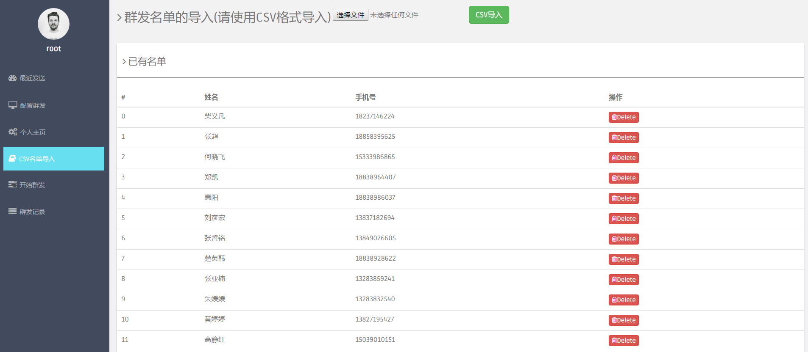

**图4-8 信息群发页**

**详细功能**

本项目主要由 CSV 名单导入和短信群 smsMass 发两大功能

- 其中具有重要特色的功能是对权限的控制上附加了对申请 key 的操作

- 其次在短信模板上可以自己相应的信息,进行合理的增删改查与默认的功能

- 对短信群发的信息有日志的记录log

- 对用户的权限处理

#### 排值班系统

**设计**

项目相关设计 UI 图如下所示

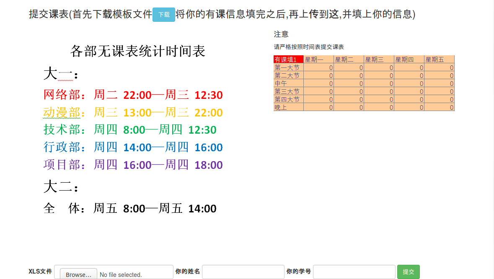

**图4-9 首页**

**详细功能**

排值班系统是一套集成C/C++暴力算法排序的，集成 xlsx 的导入与导出制作的一套系统。通过人编写的算法，对成员的值班表进行进行智能的分析，以不重复安排一个人的前提下，尽量将每个成员分配上去，以保证公平，公正。但是最主要的是减少人工排课的工作量，方便管理员的导入导出与使用。

#### 学习平台

**设计**

项目相关设计 UI 图如下所示

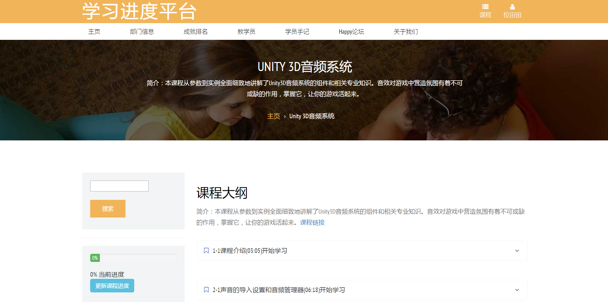

**图4-10 课程页**

**图4-11 手记页**

**详细功能**

本项目由学习进度 course 和文章发表 article 两大功能。

- 其中具有重要特色的功能是慕课网信息的爬取与使用 spider，利用superagent插件。

- 其次具有简单的用户登录和注册 user ，用户的头像上传

- 对用户的学习进度进行排序 rank (可以比较出学员的积极性)

- 对课程 course 的搜索 search

- 还有对每个列表页面进行分页 page 处理

- 访客次数统计 pv

### Vue 与 Koa 前后端分离

#### 邮件发送平台

**设计**

项目相关设计 UI 图如下所示

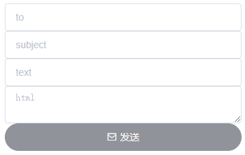

**图4-10 发送页**

**详细功能**

本项目利用 nodemailer 和 QQ 邮箱的 STMP 利用，加上独特的域名配置，可以实现简单的 HTML 格式邮件发送。

